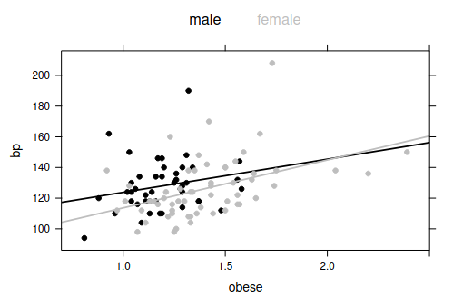

```{r setup, include=FALSE}
knitr::opts_chunk$set(echo = TRUE)
```

# Compito del 13 febbraio 2017

## EDA

Let us consider the dataframe bp.obese of the library ISwR, which
comprises information about sex, obesity and blood pressure for a random
sample of 102 Mexican-American adults in a small California town. The
help file and the output of the str command are given below

```{r, echo=FALSE, printr.help.sections="format"}
library(ISwR)
help(bp.obese)
summary(bp.obese)
```

The aim of the study is to analyze the potential relationship between
blood pressure, which is the response variable, and obesity, taking into
account also the factor regressor sex. Describe how to perform a
preliminary data analysis on this dataframe, using suitable R commands
and comment the following plot.



### Panoramica sul dataset

Il dataset è costituito da tre variabili. `obese` e `bp` sono variabili numeriche (la prima continua, la seconda probabilmente intera, e quindi discreta), mentre `sex` - seppur è rappresentato come un numero - è una variabile categoriale nominale.

```{r}
# trasformo sex in fattore
bp.obese2 <- bp.obese
bp.obese2$sex <- factor(bp.obese$sex, levels = c(0, 1), labels=c("M", "F"))
```

```{r}
summary(bp.obese2)
```

In base a quanto riportato dall'help, il dataset è costituito da 102 osservazioni.

```{r}
nrow(bp.obese2)
```

### Variabili 


#### Analisi della variabile obese:

```{r}
par(mfrow=c(1, 2))

# istogramma con media e mediana
hist(bp.obese2$obese)
abline(v=mean(bp.obese2$obese), col="blue")
abline(v=median(bp.obese2$obese), col="green")

# boxplot
boxplot(bp.obese2$obese)

# istogramma delle probabilità con curva di densità e distrib. normale sovrapposta
x <- seq(0.81, 2.4, by=0.001)
hist(bp.obese2$obese, probability=T)
abline(v=mean(bp.obese2$obese), col="blue")
lines(density(bp.obese2$obese), col="orange")
lines(x, dnorm(x, mean(bp.obese2$obese), sd(bp.obese2$obese)), col="red")

# qq-plot
qqnorm(bp.obese2$obese)
qqline(bp.obese2$obese, col="red")

par(mfrow=c(1,1))
```

La variabile obese segue una distribuzione vagamente a campana, ma è difficile ricondurla ad una distribuzione normale. La media e la mediana sono molto vicine e la distanza tra i quartili (e tra quartili e max/min) sembra essere abbastanza costante; detto ciò, non si può affermare che c'è simmetria.

Osservando la curva di densità - accostata ad una distribuzione normale - si osserva una campana più stretta e code tendenzialmente più leggere (se non fosse per la coda destra appesantita da potenziali outlyer). I quantili sulle code si discostano da quelli di una distrib. normale (specie a destra). 

Valutare la rimozione degli outlyer o la trasformazione in una scala diversa (e.g., logaritmica).

```{r}
library(moments)

skewness(bp.obese2$obese)
kurtosis(bp.obese2$obese)
```

Si conferma la presenza di assimmetria destra. Si ha infine alta curtosi (probabilmente a causa degli outlyer).

#### Analisi della variabile bp

```{r}
par(mfrow=c(1, 2))

hist(bp.obese2$bp)
abline(v=mean(bp.obese2$bp), col="blue")
abline(v=median(bp.obese2$bp), col="green")

boxplot(bp.obese2$bp)

x <- seq(80, 208, by=1)
hist(bp.obese2$bp, probability=T)
abline(v=mean(bp.obese2$bp), col="blue")
lines(density(bp.obese2$bp), col="orange")
lines(x, dnorm(x, mean(bp.obese2$bp), sd(bp.obese2$bp)), col="red")

qqnorm(bp.obese2$bp)
qqline(bp.obese2$bp, col="red")

par(mfrow=c(1,1))
```

La variabile numerica intera bp segue anch'essa una distribuzione a campana, sempre con una coda lunga destra e leggera a sinistra. Anche in questo caso la media e la mediana sono vicine, ma la distanza è più marcata.

Per quanto riguarda il boxplot, si osserva una distribuzione abbastanza assimmetrica, con le distanze tra i quartili tutte diverse. Si osservano due outlyer abbastanza lontani dai dati a destra.

I quantili sembrano discostarsi da quelli teorici di una distrib. normale non soltanto nelle code (la coda destra è sempre la peggiore).

Dal calcolo degli indici si conferma un'assimmetria destra; si osserva infine anche una leggera curtosi (seppur l'indice è basso, il test statistico riporta un p-value abbastanza basso).

```{r}
skewness(bp.obese2$bp)
kurtosis(bp.obese2$bp)

# ks.test(bp.obese2$bp,pnorm)

fBasics::dagoTest(bp.obese2$bp)
```

Si suggerisce di valutare una trasformata (e.g., logaritmo).

#### Analisi della variabile sex

```{r}
par(mfrow=c(1, 3))


barplot(table(bp.obese2$sex))
barplot(table(bp.obese2$sex)/length(bp.obese2$sex))
pie(table(bp.obese2$sex))

par(mfrow=c(1, 1))

```

Nel campione selezionato, si ha un numero maggiore di femmine rispetto a maschi.

#### Analisi multivariata


```{r}
par(mfrow=c(1,3))

# correlaz. tra var numeriche
plot(bp~obese, data=bp.obese2)
abline(lm(bp~obese, data=bp.obese2), col="red")
lines(lowess(bp.obese2$bp~bp.obese2$obese), col="black")

# correlaz. tra var numerica e var categoriale
boxplot(bp~sex, data=bp.obese2)

# correlaz. tra var numerica e var categoriale
boxplot(obese~sex, data=bp.obese2, normCurve=F, compact=F)

par(mfrow=c(1,1))
```

La variabile obese sembra influire lievemente sul valore di bp, anche se dal plot si evidenzia la debolezza della correlazione.

Il fattore sex, non sembra influire tanto sulla collocazione di obese quanto sulla sua variabilità. Per le osservazioni relative ad individui di sesso femminile, sembra esserci una variabilità più ampia per bp. I valori medi invece sembrano essere simili.

```{r}
mean(bp.obese2[bp.obese2$sex=="F", "bp"])
mean(bp.obese2[bp.obese2$sex=="M", "bp"])

# test rapido, su ipotesi che le medie seguano una distrib. 
# normale per il teorema del limite centrale
t.test(bp.obese2[bp.obese2$sex=="F", "bp"], bp.obese2[bp.obese2$sex=="M", "bp"])
```

Si osserva infine che la popolazione di sesso femminile sembra avere valori più alti per la variabile obese. Ciò potrebbe portare ad un effetto di collinearità

 

Da questo grafico finale infine si possono fare una serie di osservazioni:

* la retta di regressione per la popolazione femminile sembra essere leggermente più pendente rispetto a quella della pop. maschile (che però ha intercetta abbastanza più elevata).

* per la popolazione femminile, si osservano alcuni valori estremi per la variabile obese. Probabilmente tali punti costituiscono importanti leve per la retta.

* i valori più estremi di bp non sembrano essere associati a livelli altrettanto estremi per obese.

* la popolazione femminile sembra presentare livelli leggermente più alti per obese e una variabilità più elevata per bp.


## Comparazione tra modelli

After fitting these linear models
`fit1 <- lm(bp ∼ obese,data=bp.obese)`,
`fit2 <- lm(bp ∼ obese+sex,data=bp.obese)` and
`fit3 <- lm(bp ∼ obese*sex,data=bp.obese)`, the following outputs are
obtained by the R function summary.

Describe how to interpret these results, and then suggest how to proceed
with further analyses.

```{r}
fit1 <- lm(bp ~ obese,data=bp.obese)
fit2 <- lm(bp ~ obese+sex,data=bp.obese)
fit3 <- lm(bp ~ obese*sex,data=bp.obese)
```

```{r}
summary(fit1)
```

Da questo primo modello lineare semplice, si osserva che nel test t sul regressore obese si ottiene un p-value non troppo piccolo ma comunqe inferiore a 0.001. Analogamente anche il test F sul modello riporta un risultato analogo, pertanto si conferma che il regressore aiuta a spiegare la varianza di bp.

Detto ciò, l'indice di determinazione indica che la varianza spiegata dal modello è molto bassa. 
s

```{r}
summary(fit2)
```

In questo secondo modello, si introduce anche il fattore sex. Dai test sui coefficenti si può affermare che obese rimane la principale variabile esplicativa; l'alto p-value del fattore sex indica che i dati non forniscono prove sufficenti per affermare che esiste una correlazione significativa tra sex e bp. 

Nonostante ciò, si osserva che si ottiene un risultato migliore per quanto riguarda l'indice di determinazione, sullo standard error residuo e sul test F, quindi tale modello sempra essere leggermente più esplicativo rispetto al modello semplice. 


```{r}
summary(fit3)
```

Nel terzo modello si considera anche l'effetto iterazione tra sex ed obese. Si osserva che i p-value sui regressori sono tutti piuttosto elevati e il p-value sul test F peggiora a sua volta. 

Si osserva un leggero miglioramento sull'indice di determinazione, ma un peggioramento sulla sua versione corretta.

Complessivamente, tale modello sembra essere peggiore rispetto al precedente.


Per proseguire si suggerisce di:

* confrontare i modelli anche tramite i criteri AIC e BIC:

```{r}
AIC(fit1, fit2, fit3)
BIC(fit1, fit2, fit3)
```

(il secondo modello risulta il migliore nell'AIC, mentre il primo nel BIC)

* Effettuare un'analisi completa della varianza sul terzo modello, per provare definitivamente quali parametri vale la pena mantenere (si osserva che l'effetto iterazione obese:sex non risulta interessante --> il modello migliore rimane il secondo). 

```{r}
anova(fit3)
```


* analizzare le diagnostiche (specie del secondo modello) per valutare se la presenta di outlyer compromette l'analisi.

```{r}
par(mfrow=c(2,3))
# plot(fit1, which=(1:6))
plot(fit2, which=(1:6))
# plot(fit3, which=(1:6))
par(mfrow=c(1,1))
```

```{r}
bp.obese[15, ]
bp.obese[20, ]
bp.obese[65, ]
bp.obese[102, ]
```

Si osserva che i punti che presentano maggiori residui, un discostamento più elevato dai quantili (e - tendenzialmente - distanze di cook più elevate). Detto ciò, nessun punto presenta distanze di cook veramente elevate tali da evidenziare effetti leva causa di distorsioni.

Si suggerisce sia di sperimentare la rimozione degli outlyer per obese, che valutare scale differenti (ad esempio, visto che entrambi le variabili numeriche sono misure biologiche e per certi versi anche sociali, valutare una scala logaritmica sia per il regressore obese che per la risposta).


```{r}
fit2log <- lm(log(bp) ~ log(obese)+sex,data=bp.obese)

summary(fit2log)

AIC(fit2log)
BIC(fit2log)

par(mfrow=c(2,3))
plot(fit2log, which=(1:6))
par(mfrow=c(1,1))

```

Nel modello in scala logaritmica si osserva:
* un notevole miglioramento del p-value del regressore log(obese)
* un miglioramento anche del p-value del fattore sex
* un leggero miglioramento dell'indice di determinazione
* punteggi migliori in AIC e BI
* una netta diminuzione delle distanze di cook

Detto ciò, si conclude affermando che i dati a disposizione non sono sufficienti a costruire un modello in grado di rappresentare una correlazione significativa. In particolare, forse sarebbe opportuno raccogliere dati che tengano conto di altre variabili esplicative.

Infine, se l'obiettivo era individuare una correlazione tra il livello di obesità e la pressione sanguigna, si può affermare che esiste una leggera correlazione, ma questa non è eccessivamente significativa e lascia molta variabilità non spiegata. Il sesso è un fattore ancora meno influente, sul quale non c'è moltissima certezza. Per l'effetto iterazione tra pressione e sesso invece non c'è proprio sostegno dei dati. 

Si esclude la possibilità di utilizzare questi modelli per effettuare previsioni.


