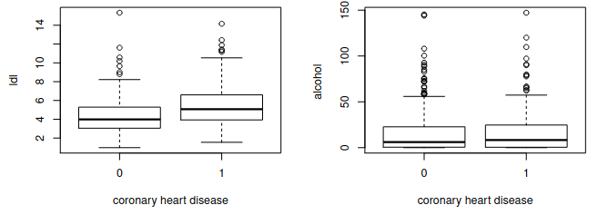

```{r setup, include=FALSE}
knitr::opts_chunk$set(echo = TRUE)
```

# Compito del 15 febbraio 2018

## EDA

Let us consider the dataframe SAheart of the library ElemStatLearn,
which comprises information about a retrospective sample of males in a
heart-disease high-risk region of the Western Cape, South Africa. The
help file and the output of the str command are given below

```{r, echo=FALSE, printr.help.sections="format"}
library(ElemStatLearn)
help(SAheart)
str(SAheart)
```

The aim of the study is to analyze the potential relationship between
the binary response variable chd and the explanatory variables
considered in the dataframe. Describe how to perform a preli- minary
data analysis on this dataframe, using suitable R commands, and comment
the following plot.


Il seguente dataset è costituito da 462 oss. e 10 variabili. 

```{r}
sah2 <- SAheart
sah2$chd <- factor(SAheart$chd)
summary(sah2)
```

Per quanto riguarda le variabili: 

* tobacco, ldl, adiposity, obesity e alcohol sono certamente variabili numeriche continue; 
* la variabile risposta chd e il fattore famhist rappresentano variabili categoriali binarie;
* age è certamente una variabile numerica discreta intera, mentre sbp e typea sembrano essere acnh'esse intere (ma forse sarebbe opportuno interrogare un'esperto del settore sul loro significato).

```{r}
sum(sah2$sbp%%1==0)
sum(sah2$typea%%1==0)
sum(sah2$age%%1==0)
```

```{r}
summary_numerical("tobacco", data=sah2, normCurve=T, compact=T)
summary_numerical("ldl", data=sah2, normCurve=T, compact=T)
summary_numerical("adiposity", data=sah2, normCurve=T, compact=T)
summary_numerical("obesity", data=sah2, normCurve=T, compact=T)
summary_numerical("alcohol", data=sah2, normCurve=T, compact=T)

summary_numerical("sbp", data=sah2, normCurve=T, compact=T)
summary_numerical("typea", data=sah2, normCurve=T, compact=T)
summary_numerical("age", data=sah2, normCurve=F, compact=T)
```

* Le variabili adiposity e typea sembrano seguire una distribuzione a campana abbastanza simile ad una normale;
* Le variabili tobacco, Idl, obesity, alchool e sbp hanno distribuzioni sempre a campana ma tutte caratterizzate da una coda destra più o meno pesante;
* age infine ha una curva di densità irregorale, con concentrazioni nella fascia sotto i 20 anni e oltre i 40.

```{r}
summary_categorial("famhist", data=sah2)
summary_categorial("chd", data=sah2)
```

Per quanto riguarda le due variabili binarie, in entrambi i casi si osserva una predominanza di "false". Tale predominanza è più forte per la variabile risposta chd.


```{r}
par(mfrow=c(2,4))

correlation_check_numfactor("chd", "tobacco", data=sah2)
correlation_check_numfactor("chd", "ldl", data=sah2)
correlation_check_numfactor("chd", "adiposity", data=sah2)
correlation_check_numfactor("chd", "obesity", data=sah2)
correlation_check_numfactor("chd", "alcohol", data=sah2)
correlation_check_numfactor("chd", "age", data=sah2)
correlation_check_numfactor("chd", "sbp", data=sah2)
correlation_check_numfactor("chd", "typea", data=sah2)

par(mfrow=c(1,1))


```

Da un confronto rapido dei boxplot delle variabili numeriche raggruppate, si osserva che le variabili tobacco, ldl, adiposity, age e sbp sembrano avere delle correlazioni con chd. Su alchol, typea e obersity invece tali relazioni sembrano meno importanti. 

Per alcune variabili, si osserva una variabilità differente per i diversi lv di chd.


```{r}
correlation_check_categorial("famhist", "chd", data=sah2, stats = T, statsTest = T)
```

Si osserva infine che il fattore famhist sembra influire positivamente sulla risposta chd (a fronte del livello "Present", si osservano maggiori risposte positive). Inoltre, il test chi-quadro sulla tabella di contigneza spinge a rifiutare l'ipotesi di indipendenza tra le due variabili.


NOTA: a causa del grande numero di variabili, tale analisi preliminare è da considerarsi piuttosto "frettolosa". A questo punto sarebbe opportuno mostrare tali risultati ad un esperto del settore e discutere sulle variabili esplicative numeriche più interessanti da esplorare. 




Questi grafici illustrano la correlazione tra la var. risposta chd e le variabili Idl e alchool, mostrando come varia la distribuzione delle variabili numeriche Idl e alchool in base al fattore chd.

Dal primo grafico si osserva che ldl tende ad assumere valori leggermente più elevati quanto la risposta assume valore 1, ciò potrebbe essere indice dell'esistenza di una correlazione.

Dal secondo grafico invece si osserva come la distrib di alchol non sembra essere troppo influenzata da cht, pertanto probabilmente la variabile alchol non è esplicativa per quantdo riguarda chd. 


```{r}
correlation_check_numfactor("chd", "ldl", data=sah2, stats = T)
correlation_check_numfactor("chd", "alcohol", data=sah2, stats = T)

# correlation_check_num("chd", "ldl", data=SAheart, stats = T)

```

## Modello 

With the command
`mod0 <- glm(chd ∼ ldl, data = SAheart, family = binomial)`, a simple
logistic regression model is defined for describing the potential effect
of the level of ldl on the probability of coronary heart disease.
Comment the model fitting outcomes given by the function summary.

```{r echo=FALSE}
mod0 <- glm(chd ~ ldl, data = SAheart, family = binomial)
summary(mod0)
```

After fitting these two further logistic regression models
`mod1 <- glm(chd ∼ ., data = SAheart, family = binomial)` and
`mod2 <- glm(chd ∼ tobacco + ldl + famhist + typea + age + ldl:famhist, data = SAheart, family = binomial)`,
the following outputs are obtained by the R function summary.

```{r echo=FALSE}
mod1 <- glm(chd ~ ., data = SAheart, family = binomial)
mod2 <- glm(chd ~ tobacco + ldl + famhist + typea + age + ldl:famhist, data = SAheart, family = binomial)

summary(mod1)
summary(mod2)
```

Describe how to interpret these results, and then suggest how to proceed
with further analyses.