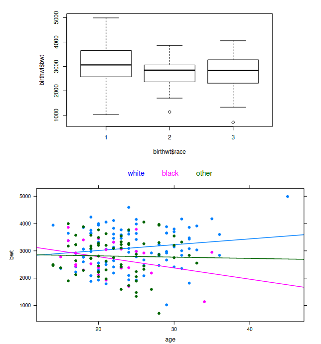

Let us consider the dataframe birthwt, which contains data on 189 births
at the Baystate Medical Centre, Springfield, Massachusetts during 1986.
The focus is on the variables listed below

```{r echo=FALSE, printr.help.sections="format"}
library(MASS)
help("birthwt")
data("birthwt")
```

The aim of the study is to analyze the potential relationship between
the response variable bwt and the explanatory variables age and race.
Describe how to perform a preliminary data analysis on this dataframe
using suitable R commands and comment the following plots

### EDA
```{r}
source("./../functions.R", local = knitr::knit_global())

str(birthwt)
```

```{r}
birthwt$low = factor(birthwt$low)
birthwt$race = factor(birthwt$race, labels = c("white", "black", "other"))
birthwt$smoke = factor(birthwt$smoke)
birthwt$ptl = factor(birthwt$ptl)
birthwt$ht = factor(birthwt$ht)
birthwt$ui = factor(birthwt$ui)
birthwt$ftv = factor(birthwt$ftv)

summary(birthwt)
```

```{r}
numeric.graph(birthwt, variables = c(2,3,10), qqplot = 10)
categorical.graph(birthwt, c(1,4:9))
```
La variabile risposta ha una curva a campana molto simile a una normale (come visibile
sia dalla curva di densità che dal qqplot, oltre che da simmetria e curtosi).

Si nota una buona simmetria e curtosi anche per `age`, mentre `lwt` presenta una
distribuzione con una curva a campana asimmetrica e con molti oulier sulla coda destra.

I grafici di `ptl` e `ftv` assomigliano a quelli di una distribuzione geometrica.

I grafici di `ht`, `ui` e `race` mostrano la presenza di fattori con poche osservazioni sul totale,
mentre per `smoke` e `low` i due fattori sono distribuiti abbastanza equamente tra le osservazioni.

```{r}
scatterplots.graph(response.var = 10, esplicative.vars = c(2,3), data = birthwt)
boxplots.graph(response.var = 10, esplicative.vars = c(1,4:9), data = birthwt)

with(data = birthwt, cor(bwt, age, method = "pearson"))

with(data = birthwt, cor(bwt, lwt, method = "spearman"))
```
I grafici e i coefficienti mostrano delle deboli correlazioni lineari con `bwt` per quanto riguarda
`age` e `lwt`.
Si notano invece delle correlazioni molto forti con `low` e `ui`, mentre con `smoke` e
`ht` sembrano essere più deboli.




Il secondo grafico rappresenta lo scatterplot tra `bwt` ed `age`, con i punti raggruppati in base
al valore di `race` e per ogni gruppo è stata tracciata la retta di regressione.

In order to describe the potential relationship between birth weight and
age, taking into account also the factor race, we compare the following
nested models

```{r}
bwt.lm1 <- lm(bwt ~ 1 , data = birthwt)
bwt.lm2 <- lm(bwt ~ age, data = birthwt)
bwt.lm3 <- lm(bwt ~ race + age, data = birthwt)
bwt.lm4 <- lm(bwt ~ race * age, data = birthwt)
```

Describe the four models and comment the results given by the Analysis
of Variance Table, reported below. Moreover, propose some alternative
model selection procedures.

```{r}
anova(bwt.lm1, bwt.lm2, bwt.lm3, bwt.lm4)
```

```{r}
# Come comportarsi in questi casi?
# Cosa mettere prima?

anova(lm(bwt ~ age*race, data = birthwt))

anova(lm(bwt ~ race*age, data = birthwt))
```

Let us consider Model 3 and comment the output obtained by the R
functions summary and plot.

```{r echo=FALSE}
summary(bwt.lm3)
plot(bwt.lm3, which = 1:4)
```

Il modello con solo gli effetti principali rispetta le ipotesi di linearità,
omoschedasticità e normalità dei residui.

Si segnalano 3 osservazioni particolarmente influenti nel modello.

Si nota un particolare effetto di clusterizzazione dei fitted values in due gruppi
distinti.

Finally, discuss the following graphical output and then suggest how to
proceed with further analyses.


Questo è lo scatterplot del modello di cui sopra. Avendo inserito solo gli effetti principali
nel modello, le tre rette sono parallele.

Da questo grafico sono visibili i due cluster individuati nei grafici diagnostici:
il cluster a sinistra sono i fitted values con fattore `race`= "black" o "other",
il cluster più a destra sono i fitted values con valore `race`="white".


Proviamo a scegliere il modello migliore per il dataset.
Cerchiamo i regressori più significativi:
```{r}
drop1(lm(bwt~., data=birthwt), test="F")
```

I 4 regressori più significativi sono `low`, `rage`, `smoke` e `ui`.
```{r}
bwt.lm5 <- lm(bwt~low + smoke + race + ui, data = birthwt)
summary(bwt.lm5)
plot(bwt.lm5, which=1:4)
```

Il nuovo modello rispetta le ipotesi di linearità e omoschedasticità, l'ipotesi di
normalità dei residui è parzialmente rispettata, infatti la linea dei residui 
standardizzati si discosta dai quantili teorici sulle code e centralmente, ma non in
maniera esagerata.
Non ci sono punti particolarmente influenti (la massima distanza di Cook è <0.08).

