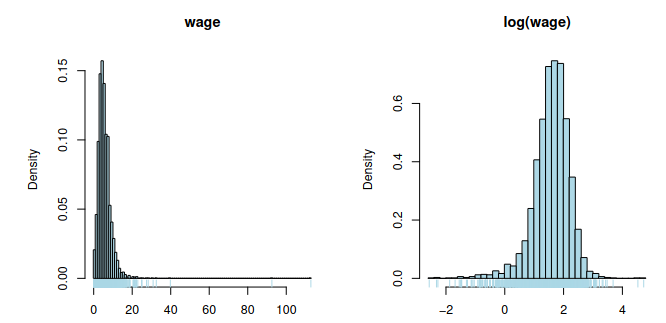

Let us consider the dataframe `wages`, which containes information about
3294 USA working individuals. The data are taken from the National
Longitudinal Survey and are related to 1987. The variable as are listed
below and the output of the `str` command is given

| A data frame with 3294 observations on the following 4 variables.
| exper
|    experience in years
| male
|   1 male, 0 female
| school
|    years of schooling
| wage
|    wage (in 1980\$) per hour
| region
|    Center, North, South

```{r echo=FALSE, printr.help.sections="format"}
wages <- read.table("./../data/Wages-New.txt", header = TRUE)
wages$male <- factor(wages$male, labels = c("female", "male"))
wages$region <- factor(wages$region)
str(wages)
```

The aim of the study is to analyze the potential relationship between
the response variable wage and the explanatory variables considered in
the dataframe. Describe how to perform a preliminary data analysis on
this dataframe, using suitable R commands. Moreover, consider the
following plots and discuss the possibility of measuring the variable
`wage` in the logarithmic scale

### Distribuzione delle variabili
```{r}
source("./../functions.R", local = knitr::knit_global())
summary(wages)
numeric.graph(wages, c(4,1,3), qqplot = 4, no.density = c(1,3), draw.normal.curve = c(1,3))
categorical.graph(wages, c(2,5))
```

La variabile risposta presenta una elevatissima simmetria e curtosi, con i valori
praticamente tutti concentrati a sinistra del grafico con la presenza di due outlier elevatissimi.
Il qqplot conferma la presenza di una coda destra molto pesante, mentre i quantili
centrali seguono abbastanza bene la distribuzione normale.
Si consiglia perciò o di rimuovere gli outlier più lontani oppure di introdurre una trasformata.

exper invece sembra seguire piuttosto bene la curva della distribuzione normale
(buona simmetria, curtosi leggermente ipernormale).

Considerazioni simili valgono anche per school (anche qui buona simmetria),
la distribuzione di presenta con una frequenza del valore centrale (11) molto
elevata e una coda sinistra leggermente appesantita.

Vista la natura di queste due variabili non ha molto senso considerare gli outlier.



```{r}
wages$logwage <- log(wages$wage)
numeric.graph(wages, 6, qqplot = 6)
```
La trasformata logaritmica migliora notevolmente sia simmetria che curtosi della variabile,
tuttavia appesantisce molto la coda sinistra (infatti la campana rimane fortemente ipernormale), 
per cui eventuali assunzioni di normalità sulla variabile vanno fatte con cautela.

### Relazioni tra variabili

```{r}
boxplots.graph(6, c(1:3,5), wages)
```
Dai grafici non sembrano esserci delle particolari correlazioni tra `log(wage)` e
le altre variabili.

```{r}
boxplots.graph(1, 2, wages)
mean(wages$exper[wages$male == 'male'])
mean(wages$exper[wages$male == 'female'])
```
Dal grafico e dal confronto delle medie sembra esserci una (debole) correlazione
tra `exper` e `male`.

### Introduzione di trasformate rimuovendo gli outlier
```{r}
#Rimuovo outlier
newWage <- wages[wages$wage < 30,]
newWage$logwage <- log(newWage$wage)
newWage$wageT <- transformResponseWithBoxCox(newWage$wage~1, newWage, 4)
numeric.graph(newWage, c(6,7), qqplot = c(6,7))
```

La trasformata di Box Cox con $\labda=0.4$ sembra preferibile rispetto a quella logaritmica.

In order to describe the effect of the factor male on the response
log(wage) we may analyze this plot, where the probability distribution
of log(wage) is represented by considering the kernel density estimates
conditioned on the two levels (1 male, 0 female) of the variable male


Il grafico conferma l'assenza di correlazione tra `log(wage)` e `male`, infatti
le due curve di densità sono praticamente sovrapponibili.

With the commands `mod.0<-lm(log(wage) ∼ male,data=wages)` and
`mod.1<-lm(log(wage) ∼ exper*male, data=wages)`, two regression models
are defined for describing the potential effect of male and exper on the
response log(wage). Comment the model fitting outcomes given by the
function summary (Hint: consider the fact that the average years of
experience in the sample is lower for women than for men).

```{r}
mod.0 <- lm(log(wage) ~ male,data=wages)
summary(mod.0)
```
```{r}
mod.1 <- lm(log(wage) ~ exper*male, data=wages)
summary(mod.1)
```
Il confronto tra i due modelli mostra come l'interazione tra exper e male (rappresentato dalla
variabile dummy `malemale`) sia rilevante nel modello, di conseguenza lo sono anche
i loro main effects.

Finally, a complete regression model is fitted
`mod.2 <- lm(log(wage) ∼., data=wages)` and the following output is
obtained by the R function summary.

```{r}
summary(lm(log(wage) ~. -logwage, data=wages))
```

Describe how to interpret these results, and then suggest how to proceed
with further analyses.

Il modello qui presentato mostra come tutti le variabili siano regressori rilevanti
per logwage.

```{r}
plot(lm(log(wage) ~. -logwage, data = wages))
```

Il modello presenta alcune criticità dal punto di vista della normalità dei residui.
Le ipotesi di omoschedasticità e linearità sono rispettate.

### Modello alternativo
Cosa otteniamo utilizzando sempre la trasformata logaritmica senza outliers
```{r}
fitLog <- lm(logwage~exper+male+school+region, data = newWage)
summary(fitLog)
plot(fitLog)
```

```{r}
drop1(lm(wageT~exper+male+school+region, data = newWage), test = "F")
```
Dal risultato di `drop1` risulta che per la nuova trasformata il regressore `region`
non è significativo.

```{r}
fitBoxCox <- lm(wageT~exper+male+school, data=newWage)
summary(fitBoxCox)
plot(fitBoxCox)
```

La trasformata calcolata con il metodo di Box-Cox permette di rientrare (seppur parzialmente)
nell'ipotesi di normalità dei residui.

```{r}
AIC(fitLog, fitBoxCox)
BIC(fitLog, fitBoxCox)
```

Gli indici $R^2$ sono più alti nella trasformata Box Cox rispetto al logaritmo,
tuttavia le statistiche AIC e BIC tendono a preferire quest'ultima.
