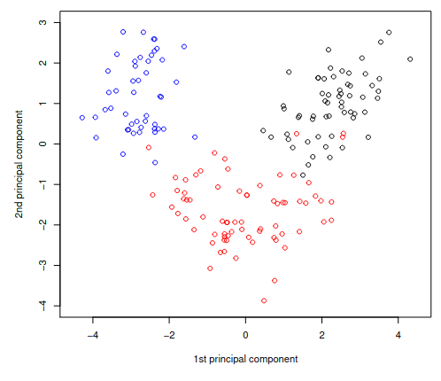

Let us consider the dataframe wine, which contains information about 178
samples of wines grown in the same region in Italy. The cultivar of each
wine sample is observed (variable cultivar, with labels 1, 2, 3),
together with the concentration of the 13 different chemicals (variables
V1-V13). Describe how to perform a preliminary data analysis on this
dataframe using suitable R commands and comment the following outputs.

```{r}
wine <- read.table("./../data/wine.txt", header = TRUE)
summary(wine)
sapply(wine[2:14],sd)
```

Moreover, discuss the results given by the scatterplot matrix considered
below, which considers the first 5 numerical variables, with colours
indicating cultivar 1 (black), cultivar 2 (red) and cultivar 3 (blue).


The aim of the study is to adequately synthesize the information given
by the original variables V1-V13, in order to capture as much of the
information as possible. A further objective is to use some of these new
derived variable for distinguishing the three different cultivars. The
Principal Components Analysis procedure is applied. Present the main
features of this stati- stical procedure, describe the arguments
specified below in the function princomp and discuss the output of the
function loadings.

```{r}
wine.pca <- princomp(wine[2:14], cor=TRUE)
loadings(wine.pca)[,1:4]
```

Moreover, discuss the following graphical outputs


Finally, comment this last plot, with particular concern to the aim of
characterizing the three different cultivars.


