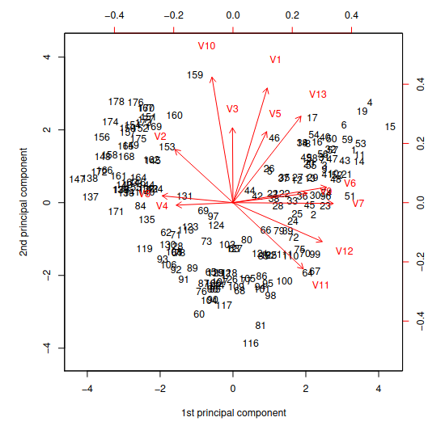

Let us consider the dataframe wine, which contains information about 178
samples of wines grown in the same region in Italy. The cultivar of each
wine sample is observed (variable cultivar, with labels 1, 2, 3),
together with the concentration of the 13 different chemicals (variables
V1-V13). Describe how to perform a preliminary data analysis on this
dataframe using suitable R commands and comment the following outputs.

```{r}
wine <- read.table("./../data/wine.txt", header = TRUE)
wine$cultivar <- factor(wine$cultivar)
summary(wine)
sapply(wine[2:14],sd)
```

```{r}
source("./../functions.R", local = knitr::knit_global())
```

```{r}
categorical.graph(wine, 1, 1)
numeric.graph(wine, 2:14)
```

#### Osservazioni

-   i fattori della variabile `cultivar` sono ben distribuiti nel dataset (le frequenze sono simili)

-   le variabili numeriche presentano tutte buona simmetria, tranne V2 e V5.

-   le deviazioni standard sono tutte sullo stesso ordine di grandezza, tranne V5 e V13.
    Quest'ultimo è completamente fuori scala rispetto agli altri.

```{r}
cor(wine[, 2:6], method = "pearson")
```

Moreover, discuss the results given by the scatterplot matrix considered
below, which considers the first 5 numerical variables, with colours
indicating cultivar 1 (black), cultivar 2 (red) and cultivar 3 (blue).


Il grafico, insieme alla matrice di correlazione, sembra suggerire una debole
correlazione lineare tra V3 e V4 ($r \approx 0.44 $).
Dal grafico non è possibile capire se sono presenti effetti di interazione significativi
tra le singole variabili e `cultivar`, per fare ciò bisognerebbe eseguire un analisi dei
modelli di covarianza.

The aim of the study is to adequately synthesize the information given
by the original variables V1-V13, in order to capture as much of the
information as possible. A further objective is to use some of these new
derived variable for distinguishing the three different cultivars. The
Principal Components Analysis procedure is applied. Present the main
features of this statistical procedure, describe the arguments
specified below in the function princomp and discuss the output of the
function loadings.

```{r}
wine.pca <- princomp(wine[2:14], cor=TRUE)
loadings(wine.pca)[,1:4]
```

Questa è la matrice dei loadings (i coefficienti) delle prime quattro
componenti principali.

La prima componente principale dà maggior peso a V7, V6 e V12, con pesi abbastanza simili.

La seconda componente principale dà maggior peso a V1, V10 e V13. I loadings di V11 sono
molto simili (in valore assoluto).

La terza componente dà maggior peso a V3 e V4.

La quarta componente dà maggior peso a V2, V5 e V9.

Moreover, discuss the following graphical outputs


Da questo grafico si notano 5 gruppi di variabili molto vicini tra loro:

-   V6, V9, V7, V12, V11

-   V8 e V4

-   V10, V3, V1, V5, V13

-   V2, a metà tra il secondo e il terzo gruppo di variabili

Ne deduciamo che per spiegare la gran parte della varianza del dataset sono necessarie circa 4/5 componenti
principali.

In questo biplot si può notare la disposizione delle osservazioni rispetto alle prime 
due componenti principali. Si può notare una certa simmetria delle osservazioni rispetto 
alla prima componente principale.

C'è una regione del grafico in cui sono presenti pochissime informazioni, quella corrispondente
alla fascia (-2,2) sulla prima componente e (3,4.5) sulla seconda, a indicare che non ci sono vini
con V7, V6, V12 nella media e alti valori di V1, V10, V13.


Dai grafici della proporzione della varianza spiegata, si nota che la prima componente principale da sola spiega molto poco della varianza (ca. 35%).

I grafici supportano l'ipotesi sul numero di componenti principali necessarie fatte in precedenza,
infatti si nota come in corrispondenza della quinta componente principale la varianza
spiegata delle singole componenti sia trascurabile e si raggiunga circa l'80% di varianza
cumulata.


Finally, comment this last plot, with particular concern to the aim of
characterizing the three different cultivars.


Da questo scatterplot si notano tre cluster di dati (corrispondenti ai tre fattori)
di cultivar, confermando l'ipotesi iniziale che fosse possibile classificare
i vini in base alle componenti principali (in questo caso ne bastano due).