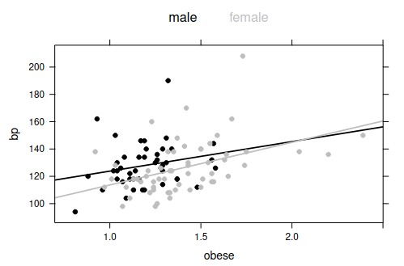

```{r setup, include=FALSE}
knitr::opts_chunk$set(echo = TRUE)
library(printr)
```

# esercizi di laboratorio su dataset

## Compito del 1 febbraio 2017

Let us consider the dataframe mtcars, which comprises the fuel
consumption and 10 aspects of design and performance for 32 automobiles
(1970s models). The help file is given below

```{r echo=FALSE, printr.help.sections="format"}
help(mtcars)
```

Describe how to perform a preliminary data analysis on this dataframe,
using suitable R commands.


## Compito del 13 febbraio 2017

Let us consider the dataframe bp.obese of the library ISwR, which
comprises information about sex, obesity and blood pressure for a random
sample of 102 Mexican-American adults in a small California town. The
help file and the output of the str command are given below

```{r, echo=FALSE, printr.help.sections="format"}
library(ISwR)
help(bp.obese)
summary(bp.obese)
```

The aim of the study is to analyze the potential relationship between
blood pressure, which is the response variable, and obesity, taking into
account also the factor regressor sex. Describe how to perform a
preliminary data analysis on this dataframe, using suitable R commands
and comment the following plot.




After fitting these linear models
`fit1 <- lm(bp ∼ obese,data=bp.obese)`,
`fit2 <- lm(bp ∼ obese+sex,data=bp.obese)` and
`fit3 <- lm(bp ∼ obese*sex,data=bp.obese)`, the following outputs are
obtained by the R function summary.

```{r echo=FALSE}
fit1 <- lm(bp ~ obese,data=bp.obese)
fit2 <- lm(bp ~ obese+sex,data=bp.obese)
fit3 <- lm(bp ~ obese*sex,data=bp.obese)

summary(fit1)
summary(fit2)
summary(fit3)
```

Describe how to interpret these results, and then suggest how to proceed
with further analyses.

## Compito del 15 febbraio 2018

Let us consider the dataframe SAheart of the library ElemStatLearn,
which comprises information about a retrospective sample of males in a
heart-disease high-risk region of the Western Cape, South Africa. The
help file and the output of the str command are given below

```{r, echo=FALSE, printr.help.sections="format"}
library(ElemStatLearn)
help(SAheart)
str(SAheart)
```

The aim of the study is to analyze the potential relationship between
the binary response variable chd and the explanatory variables
considered in the dataframe. Describe how to perform a preli- minary
data analysis on this dataframe, using suitable R commands, and comment
the following plot.


With the command
`mod0 <- glm(chd ∼ ldl, data = SAheart, family = binomial)`, a simple
logistic regression model is defined for describing the potential effect
of the level of ldl on the probability of coronary heart disease.
Comment the model fitting outcomes given by the function summary.

```{r echo=FALSE}
mod0 <- glm(chd ~ ldl, data = SAheart, family = binomial)
summary(mod0)
```

After fitting these two further logistic regression models
`mod1 <- glm(chd ∼ ., data = SAheart, family = binomial)` and
`mod2 <- glm(chd ∼ tobacco + ldl + famhist + typea + age + ldl:famhist, data = SAheart, family = binomial)`,
the following outputs are obtained by the R function summary.

```{r echo=FALSE}
mod1 <- glm(chd ~ ., data = SAheart, family = binomial)
mod2 <- glm(chd ~ tobacco + ldl + famhist + typea + age + ldl:famhist, data = SAheart, family = binomial)

summary(mod1)
summary(mod2)
```

Describe how to interpret these results, and then suggest how to proceed
with further analyses.

## Compito del 11 giugno 2018

Let us consider the dataframe `house`, which includes information about
the price, the size, the floor, the number of bedrooms (bed) and the
number of bathrooms (bath) of 546 houses. The output of the str command
is given below

```{r echo=FALSE}
house <- read.table("./data/house-prices.dat", header=TRUE)
str(house)
```

A suitable linear regression model can be defined in order to study the
potential relationship between the price, which is the response
variable, and the explanatory variables considered in the dataframe.
Describe how to perform a preliminary data analysis on this dataframe,
using suitable R commands. Moreover, consider the following plots and
discuss the possibility of measuring the variables price and size in the
logarithmic scale.


After fitting the regression model
`fit <- lm(log(price) ∼ log(size) + bed + bath + floor, data=house)`,
the following outputs are obtained by the R commands `summary(fit)` and
`plot(fit)`, respectively.

```{r echo=FALSE, eval=FALSE}
fit <- lm(log(price) ~ log(size) + bed + bath + floor, data=house)
summary(fit)
plot(fit, lwd = 2, which = c(1:6))
```

Describe how to interpret these results, and then suggest how to proceed
with further analyses with particular regard to prediction.

## Compito del 4 febbraio 2019

Let us consider the dataframe `wages`, which containes information about
3294 USA working individuals. The data are taken from the National
Longitudinal Survey and are related to 1987. The variable as are listed
below and the output of the `str` command is given

| A data frame with 3294 observations on the following 4 variables.
| exper
|    experience in years
| male
|   1 male, 0 female
| school
|    years of schooling
| wage
|    wage (in 1980\$) per hour
| region
|    Center, North, South

```{r echo=FALSE, printr.help.sections="format"}
wages <- read.table("./data/Wages-New.txt", header = TRUE)
wages$male <- factor(wages$male)
wages$region <- factor(wages$region)
str(wages)
```

The aim of the study is to analyze the potential relationship between
the response variable wage and the explanatory variables considered in
the dataframe. Describe how to perform a preliminary data analysis on
this dataframe, using suitable R commands. Moreover, consider the
following plots and discuss the possibility of measuring the variable
`wage` in the logarithmic scale


In order to describe the effect of the factor male on the response
log(wage) we may analize this plot, where the probability distribution
of log(wage) is represented by considering the kernel density estimates
conditioned on the two levels (1 male, 0 female) of the variable male


With the commands `mod.0<-lm(log(wage) ∼ male,data=wages)` and
`mod.1<-lm(log(wage) ∼ exper*male, data=wages)`, two regression models
are defined for describing the potential effect of male and exper on the
response log(wage). Comment the model fitting outcomes given by the
function summary (Hint: consider the fact that the average years of
experience in the sample is lower for women than for men).

```{r echo=FALSE}
mod.0 <- lm(log(wage) ~ male,data=wages)
mod.1 <- lm(log(wage) ~ exper*male, data=wages)

summary(mod.0)
summary(mod.1)
```

Finally, a complete regression model is fitted
`mod.2 <- lm(log(wage) ∼., data=wages)` and the following output is
obtained by the R function summary.

```{r echo=FALSE}
summary(lm(log(wage) ~., data=wages))
```

Describe how to interpret these results, and then suggest how to proceed
with further analyses.

## Compito del 21 febbraio 2019

Let us consider the data frame loan, which contains information about
42,535 loans ranging from 1,000 \$ to 35,000 \$, issued by a company
called Lending Club. The following variables are considered: good (the
behaviour of the client with values good and bad), fico (the FICO credit
score measuring the client credit worthiness), purpose (the intended use
of the loan, with 8 different categories), loan amt (the credit amount
in \$) and income (the annual income in \$ of the client). The variable
as are listed below and the output of the str command is given

```{r echo=FALSE, printr.help.sections="format"}
loan <- read.table("./data/loan.txt", header = TRUE)
loan$good <- factor(loan$good)
loan$purpose <- factor(loan$purpose)
str(loan)
```

Moreover, the output of the command summary is also given

```{r echo=FALSE}
summary(loan)
```

The aim of the study is to analyze the potential relationship between
the response variable good and the explanatory variables considered in
the data frame, in order to evaluate the possible good/bad behaviour of
a customer. Describe how to perform a preliminary data analysis on this
data frame, using suitable R commands. Moreover, consider and discuss
the following plots


In order to describe the effect of the factor fico on the response good
we consider a simple logistic regression model fitted using the command
`mod.1<-glm(good ∼ fico, data = loan, family = "binomial")`. Comment the
model fitting outcomes given by the function summary and the output
given by the subsequent commands.

```{r}
mod.1 <- glm(good ~ fico, data = loan, family = "binomial")
summary(mod.1)

exp(coef(mod.1))
test <- data.frame(fico=c(700,750))
test$pred <- predict(mod.1,test, type="response")
test
```

Two further logistic regression models are fitted using
`mod.2<-glm(good ∼ fico + loan_amnt, data = loan, family = "binomial")`
and
`mod.3<-glm(good ∼ fico + loan_amnt + income + purpose, data = loan, family = "binomial")`.
Comment the corresponding output obtained by the R function summary and
then suggest how to proceed with a further predictive analysis.

```{r echo=FALSE}
summary(glm(good ~ fico + loan_amnt, data = loan, family = "binomial"))
summary(glm(good ~ fico + loan_amnt + income + purpose, data = loan, family = "binomial"))
```

## Compito del 28 gennaio 2020

Let us consider the dataframe birthwt, which contains data on 189 births
at the Baystate Medical Centre, Springfield, Massachusetts during 1986.
The focus is on the variables listed below

```{r echo=FALSE, printr.help.sections="format"}
library(MASS)
help("birthwt")
```

The aim of the study is to analyze the potential relationship between
the response variable bwt and the explanatory variables age and race.
Describe how to perform a preliminary data analysis on this dataframe
using suitable R commands and comment the following plots


In order to describe the potential relationship between birth weight and
age, taking into account also the factor race, we compare the following
nested models

```{r}
bwt.lm1 <- lm(bwt ~ 1 , data = birthwt)
bwt.lm2 <- lm(bwt ~ age, data = birthwt)
bwt.lm3 <- lm(bwt ~ race + age, data = birthwt)
bwt.lm4 <- lm(bwt ~ race*age, data = birthwt)
```

Describe the four models and comment the results given by the Analysis
of Variance Table, reported below. Moreover, propose some alternative
model selection procedures.

```{r}
anova(bwt.lm1, bwt.lm2, bwt.lm3, bwt.lm4)
```

Let us consider Model 3 and comment the output obtained by the R
functions summary and plot.

```{r echo=FALSE}
summary(bwt.lm3)
plot(bwt.lm3, which = c(1:4))
```

Finally, discuss the following graphical output and then suggest how to
proceed with further analyses.


## Compito del 18 febbraio 2020

Let us consider the dataframe wine, which contains information about 178
samples of wines grown in the same region in Italy. The cultivar of each
wine sample is observed (variable cultivar, with labels 1, 2, 3),
together with the concentration of the 13 different chemicals (variables
V1-V13). Describe how to perform a preliminary data analysis on this
dataframe using suitable R commands and comment the following outputs.

```{r}
wine <- read.table("./data/wine.txt", header = TRUE)
summary(wine)
sapply(wine[2:14],sd)
```

Moreover, discuss the results given by the scatterplot matrix considered
below, which considers the first 5 numerical variables, with colours
indicating cultivar 1 (black), cultivar 2 (red) and cultivar 3 (blue).


The aim of the study is to adequately synthesize the information given
by the original variables V1-V13, in order to capture as much of the
information as possible. A further objective is to use some of these new
derived variable for distinguishing the three different cultivars. The
Principal Components Analysis procedure is applied. Present the main
features of this stati- stical procedure, describe the arguments
specified below in the function princomp and discuss the output of the
function loadings.

```{r}
wine.pca <- princomp(wine[2:14], cor=TRUE)
loadings(wine.pca)[,1:4]
```

Moreover, discuss the following graphical outputs


Finally, comment this last plot, with particular concern to the aim of
characterizing the three different cultivars.


